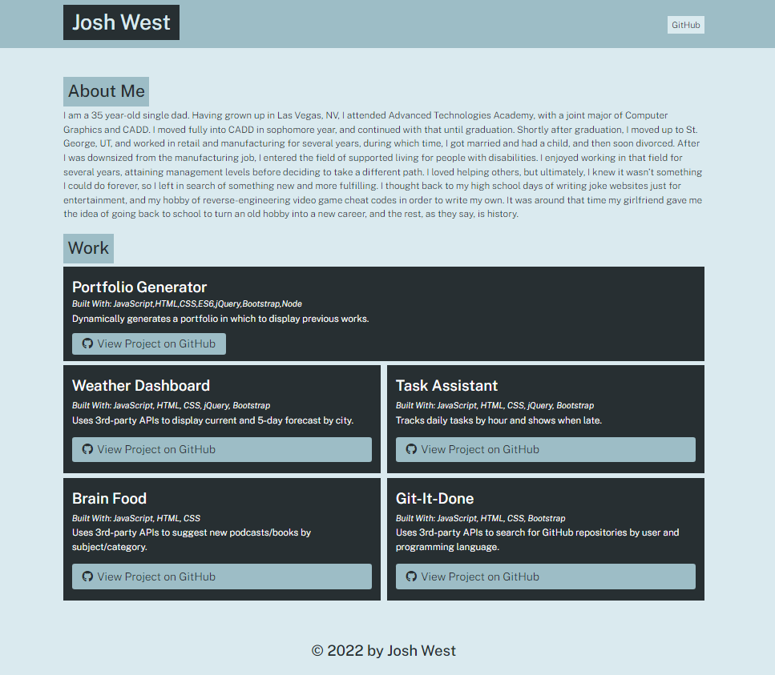

# Portfolio-Generator

## Description

Nodejs generated portfolio page
 -` My motivation was to learn to dynamically create webpages using Nodejs
 -` I built this project to display previous works
 -` This solves the problem of manually creating a new webpage
 -` I learned how to import/export functions, create promises, and use Nodejs

## Table of Contents

- [Installation](#installation)
- [Usage](#usage)
- [Credits](#credits)
- [License](#license)

## Installation

1. Download or clone repository to desired destination

## Usage
1. Open terminal and navigate to the appropriate directory
2. Enter command 'node app' and hit 'Enter'
3. Enter your information at each prompt
4. Upon completion, locate index.html in the 'dist' folder of the directory

## Built With

 - Nodejs
 - Javascript
 - JQuery
 - Bootstrap
 - CSS
 - HTML

## Screenshot

  ```md
  ![My Generated Portfolio]
  ```
  
## Deployed Application

https://superdasman.github.io/portfolio-generator/

## License

MIT License

Copyright (c) [year] [fullname]

Permission is hereby granted, free of charge, to any person obtaining a copy
of this software and associated documentation files (the "Software"), to deal
in the Software without restriction, including without limitation the rights
to use, copy, modify, merge, publish, distribute, sublicense, and/or sell
copies of the Software, and to permit persons to whom the Software is
furnished to do so, subject to the following conditions:

The above copyright notice and this permission notice shall be included in all
copies or substantial portions of the Software.

THE SOFTWARE IS PROVIDED "AS IS", WITHOUT WARRANTY OF ANY KIND, EXPRESS OR
IMPLIED, INCLUDING BUT NOT LIMITED TO THE WARRANTIES OF MERCHANTABILITY,
FITNESS FOR A PARTICULAR PURPOSE AND NONINFRINGEMENT. IN NO EVENT SHALL THE
AUTHORS OR COPYRIGHT HOLDERS BE LIABLE FOR ANY CLAIM, DAMAGES OR OTHER
LIABILITY, WHETHER IN AN ACTION OF CONTRACT, TORT OR OTHERWISE, ARISING FROM,
OUT OF OR IN CONNECTION WITH THE SOFTWARE OR THE USE OR OTHER DEALINGS IN THE
SOFTWARE.

### Contribution
Made with ❤️ by Josh West

### ©️2022 SuperDasMan Studios, LLC.

